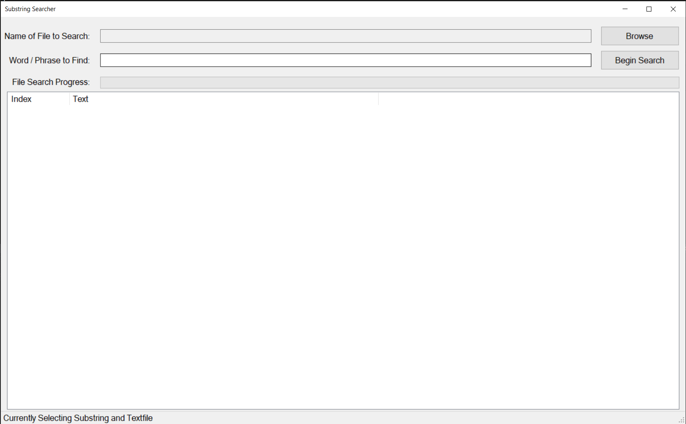
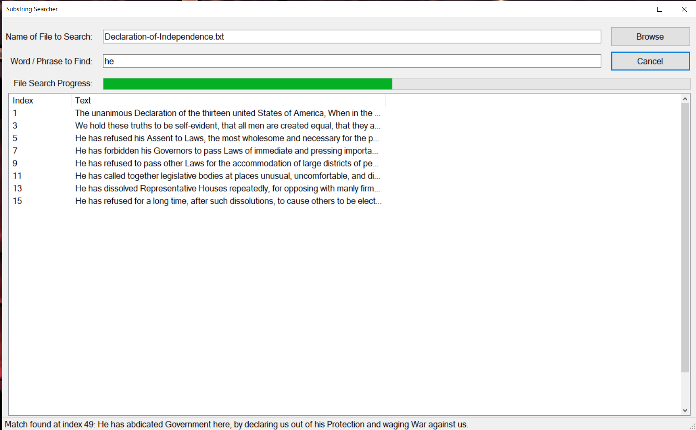

# Multithreaded-Textfile-Searcher
Developed a UI application in C# and .NET that utilizes multithreading to enable the user to search for substrings within a textfile.

Utilized the Backgroundworker and ConcurrentQueue to communicate between the searching thread and UI thread without error.

## In-Application Screenshots

Screen upon launching application:

Screen upon searching for a substring:

